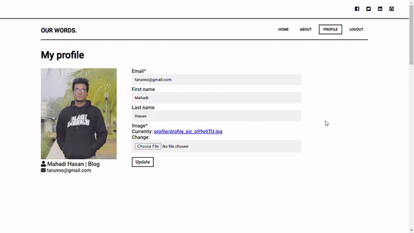

# Our Words
> Blog application built in Django 
# Home page:

# Single Post:

# Profile:

# Front-end:
- Language: HTML, CSS and JavaScript 
- Django pagination 
- Django forms 
- Responsive 
- CKeditor 4

# Back-end:
- Django
- SQLite 
- CURD 
- Django Authentication 

